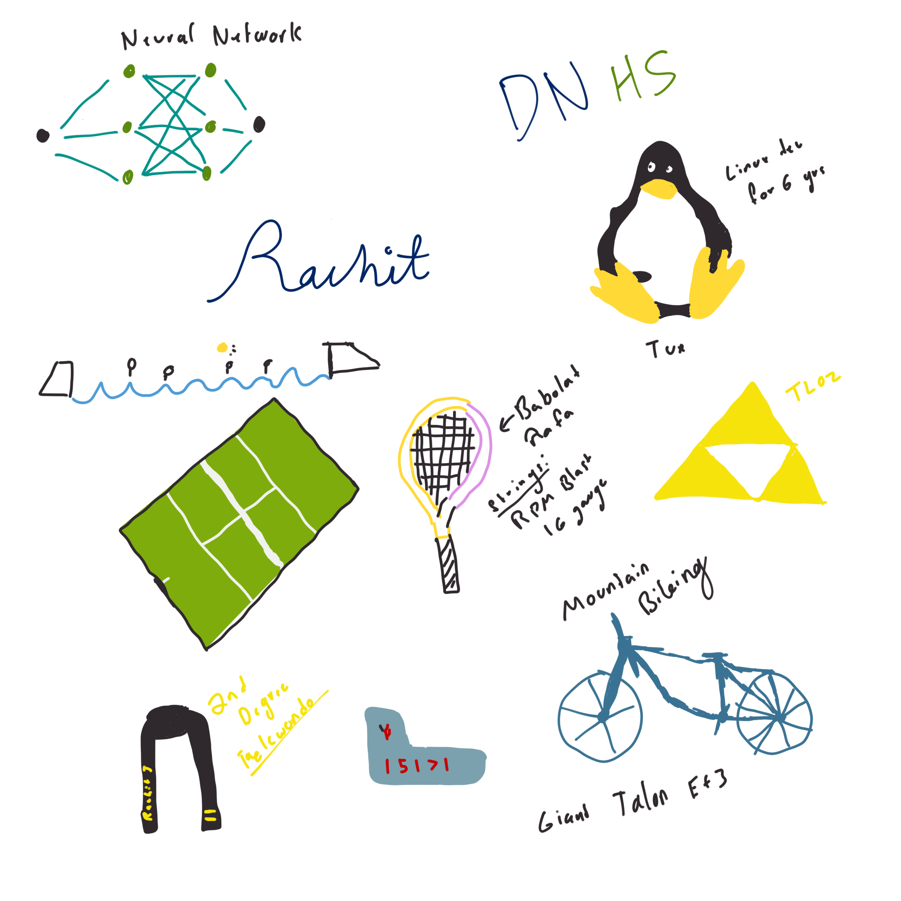

## Rachit's Page

Why is the world round? Why are we human? Why do we like food? These are all questions that we do not currently have an answer to. However, I am not here to answer those questions!

## About me!

   
    

## My Favorite Food!

   
    

## Some of my interests!

1. The Legend of Zelda: Tears of the Kingdom! [Trailer here](https://www.youtube.com/watch?v=uHGShqcAHlQ&pp=ygUMdG90ayB0cmFpbGVy)
2. Tennis! [UTR](https://app.universaltennis.com/profiles/1320939)
3. Mountain Biking! [Strava](https://www.strava.com/athletes/59848940)

## My Schedule
<table>
  <tr>
    <td>Class Name</td>
    <td>AP Physics</td>
    <td>AP Stats</td>
    <td>AP Computer Science A</td>
    <td>AP English Language</td>
    <td>Off Roll</td>
  </tr>
  <tr>
    <td>Rating /5</td>
    <td>4</td>
    <td>4</td>
    <td>5</td>
    <td>3.5</td>
    <td>4</td>
  </tr>
</table>

<a href="#" id="invertButton">Invert Colors</a>

